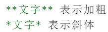
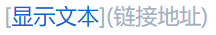
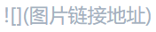

#### 文字前加 # 号设置标题，一级标题对应 1 个 # 号，二级对应 2 个，共可设置 6 级标题

#  ＃这是H1

## ##这是H2

##### #####这是H5

***

 

***

> 文字前加 > 表示引用

空白行输入***生成分割线；

***

1. 数字加英文句号生成有序列表

- 文字前加 *（或 +、-）生成无序列表

***

插入超链接： [百度](https://www.baidu.com)

插入图片：    
